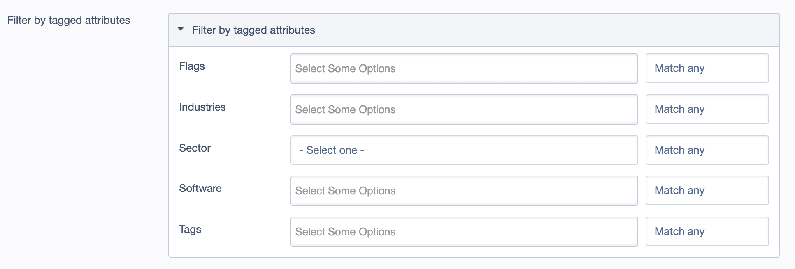

# Flexible Content Relationships for SilverStripe

Tags, categories, sectors, topics, related posts — every project needs ways to connect content. This module gives you a single, flexible system using one consistent pattern for all of them.

Define any DataObject as an "attribute" and attach it to any other DataObject. No more one-off many-many relations scattered across your codebase. Just configure, apply the extensions, and you've got polymorphic attribution that works with Versioned, publishes with your content, and handles the CMS fields automatically.

Uses a polymorphic join table with full Versioned support. Query from either direction — get attributes for an object, or get all objects with a given attribute. Supports scoped attributes for context-specific categorisation.

## Version Compatibility

| Module Version | SilverStripe Version |
|----------------|----------------------|
| `^4.0`         | 5.x, 6.x             |
| `^3.0`         | 4.x                  |

**SilverStripe 4.x users:** Please use the [3.x release line](https://github.com/fromholdio/silverstripe-attributable/tree/3).

**Upgrading from module version 3.x?** The 4.0 release is backwards-compatible for SilverStripe 5.x and 6.x implementations. See the [4.0.0 release notes](/docs/en/4x_RELEASE_NOTES.md) for details on internal changes and rationale.

## Requirements

- [silverstripe/framework](https://github.com/silverstripe/silverstripe-framework) ^5.0 or ^6.0
- [fromholdio/silverstripe-commonancestor](https://github.com/fromholdio/silverstripe-commonancestor) ^1.0

## Installation

```bash
composer require fromholdio/silverstripe-attributable ^4.0
```

Then run `vendor/bin/sake db:build --flush` (SS6) or `dev/build?flush=1` (SS5).

---

## Concepts

### What is an Attribute?

An **Attribute** is a DataObject that can be attached to other objects. Examples include:

- Tags
- Categories
- Topics
- Sectors
- Software products

Attributes are extended with `Fromholdio\Attributable\Extensions\Attribute`.

### What is an Attributable?

An **Attributable** is a DataObject that can have attributes attached to it. Examples include:

- Pages
- Products
- Articles
- Events

Attributables are extended with `Fromholdio\Attributable\Extensions\Attributable`.

### What is an Attribution?

An **Attribution** is the join record that links an Attribute to an Attributable. It stores:

- `ObjectClass` / `ObjectID` - The attributable object
- `AttributeClass` / `AttributeID` - The attribute being attached

Attributions are versioned and owned by the attributable object, so they publish and unpublish with their parent.

### Dual-Role Objects

A DataObject can be **both** an Attribute and an Attributable simultaneously. This enables powerful patterns like:

- **Related Posts** - A BlogPost can have Tags attached (as Attributable), but also BE attached to other BlogPosts (as Attribute)
- **Cross-linking** - Products can be linked to related products
- **Hierarchical relationships** - Pages can reference other pages as "See Also" links

```php
use SilverStripe\CMS\Model\SiteTree;
use Fromholdio\Attributable\Extensions\Attribute;
use Fromholdio\Attributable\Extensions\Attributable;

class BlogPost extends SiteTree
{
    private static $extensions = [
        Attribute::class,      // Can be attached to other objects
        Attributable::class,   // Can have attributes attached
    ];

    private static $allowed_attributes = [
        Tag::class,
        BlogPost::class,  // Self-referential - enables "Related Posts"
    ];
}
```

---

## Quick Start

### 1. Create an Attribute class

```php
use SilverStripe\ORM\DataObject;
use Fromholdio\Attributable\Extensions\Attribute;

class Tag extends DataObject
{
    private static $table_name = 'Tag';

    private static $db = [
        'Title' => 'Varchar(255)',
    ];

    private static $extensions = [
        Attribute::class,
    ];
}
```

### 2. Apply Attributable to your content class

```php
use SilverStripe\CMS\Model\SiteTree;
use Fromholdio\Attributable\Extensions\Attributable;

class ArticlePage extends SiteTree
{
    private static $extensions = [
        Attributable::class,
    ];

    private static $allowed_attributes = [
        Tag::class,
    ];
}
```

### 3. Run dev/build

```bash
vendor/bin/sake db:build --flush
```

Tag fields will now appear in the CMS when editing ArticlePage records.

---

## Configuration

### Attributable Configuration

Apply to the class receiving attributes.

```yaml
App\Model\ArticlePage:
  # Tab path for attribute fields in the CMS (default: Root.Attributes)
  attributes_tab_path: 'Root.Categorisation'

  # Restrict which attribute classes can be attached
  allowed_attributes:
    - App\Model\Tag
    - App\Model\Category

  # Exclude specific attribute classes
  disallowed_attributes:
    - App\Model\InternalTag
```

### Attribute Configuration

Apply to the class being attached as an attribute.

```yaml
App\Model\Tag:
  # Only allow one selection (dropdown instead of listbox)
  attribute_only_one: false  # default

  # Require a selection (no empty option)
  attribute_force_selection: true  # default

  # Scope attributes by a has_one relation (e.g., Tags per Site)
  attribute_scope_field: null  # e.g., 'SiteID'

  # URL segment for routing (used with attribute-based filtering)
  attribute_url_segment: null  # e.g., 'tag'

  # Enable nested/hierarchical attributes
  attribute_is_nested: false  # default
```

#### Scoped Attributes

Scoped attributes allow you to partition attributes by a parent object. For example, Tags that belong to a specific Site in a multi-site setup:

```php
class Tag extends DataObject
{
    private static $has_one = [
        'Site' => Site::class,
    ];

    private static $attribute_scope_field = 'SiteID';

    private static $extensions = [
        Attribute::class,
    ];
}
```

When `attribute_scope_field` is set, the CMS will display separate attribute fields for each scope object, and attributions are filtered by scope.

---

## Usage

### Attaching Attributes Programmatically

```php
$article = ArticlePage::get()->byID(1);
$tag = Tag::get()->byID(5);

// Attach a single attribute
$article->attachAttribute($tag);

// Attach multiple attributes
$tags = Tag::get()->filter('ID', [1, 2, 3]);
$article->attachAttributes($tags);
```

### Detaching Attributes

```php
// Detach a single attribute
$article->detachAttribute($tag);

// Detach multiple attributes
$article->detachAttributes($tags);

// Detach all attributes of a specific class
$article->detachAllAttributes(Tag::class);

// With scope
$article->detachAllAttributes(Tag::class, $scopeObject);
```

### Getting Attributes from an Object

```php
// Get all Tags attached to an article
$tags = $article->getAttributes(Tag::class);

// Get attributes with scope
$tags = $article->getAttributes(Tag::class, $site);

// Get attributes from multiple classes (must share a common ancestor)
$attributes = $article->getAttributes([Tag::class, Category::class]);
```

### Getting Attributed Objects from an Attribute

```php
$tag = Tag::get()->byID(1);

// Get all ArticlePages that have this tag
$articles = $tag->getAttributedObjects(ArticlePage::class);

// Get objects from multiple classes
$objects = $tag->getAttributedObjects([ArticlePage::class, ProductPage::class]);
```

### Syncing Attributes

The `syncAttributes()` method compares new attribute IDs against existing ones, attaching new attributes and detaching removed ones:

```php
// Sync to exactly these tag IDs (removes any not in the array)
$article->syncAttributes(Tag::class, [1, 2, 3]);

// With scope
$article->syncAttributes(Tag::class, [1, 2, 3], $scopeObject);
```

### Finding Related Objects

Find objects that share attributes:

```php
use Fromholdio\Attributable\Model\Attribution;

// Get all ArticlePages that share any of these tag IDs
$related = Attribution::get_related_objects(
    Tag::class,
    [1, 2, 3],  // Attribute IDs
    [ArticlePage::class]  // Object classes to search
);
```

---

## CMS Integration

Attribute fields are automatically added to the CMS based on `$attributes_tab_path` configuration.

### Customising Field Labels

Override `updateAttributeFieldLabel()` on your Attribute class:

```php
class Tag extends DataObject
{
    // ...

    public function updateAttributeFieldLabel($label, $scopeObject = null)
    {
        if ($scopeObject) {
            return 'Tags for ' . $scopeObject->Title;
        }
        return 'Article Tags';
    }
}
```

### Customising Field Source

Override `updateAttributeFieldSource()` to filter or modify the dropdown options:

```php
public function updateAttributeFieldSource($source, $scopeObject = null)
{
    // Only show published tags
    $publishedIDs = Tag::get()->filter('IsPublished', true)->column('ID');
    return array_intersect_key($source, array_flip($publishedIDs));
}
```

### Custom Dropdown Title

If your attribute uses something other than `Title` for display:

```php
class Tag extends DataObject
{
    public function getDropdownTitle()
    {
        return $this->Title . ' (' . $this->Code . ')';
    }
}
```

---

## Form Fields

### AttributeListboxField

A multi-select listbox for many-to-many attribute selection. Used automatically when `attribute_only_one` is false.

### AttributeMatchField & AttributeMatchModeField

Composite fields for building filter interfaces with "match any" or "match all" logic:

```php
use Fromholdio\Attributable\Forms\AttributeMatchField;

$tagField = Tag::singleton()->getAttributeField();
$matchField = AttributeMatchField::create(
    'TagFilter',
    $tagField,
    'TagMatchMode'
);

// Default to "match all"
$matchField->setMatchModeAll();
```



The match mode field provides two options:
- `MATCH_MODE_ANY` (0) - Match objects with any of the selected attributes
- `MATCH_MODE_ALL` (1) - Match objects with all of the selected attributes

---

## Versioning

Attribution records are **versioned** and **owned** by their parent attributable object:

```php
private static $extensions = [
    Versioned::class
];

private static $owns = [
    'Attributions'
];

private static $cascade_deletes = [
    'Attributions'
];

private static $cascade_duplicates = [
    'Attributions'
];
```

This means:
- Attributions are written to Draft when the parent is saved
- Attributions are published to Live when the parent is published via `publishRecursive()`
- Attributions are deleted when the parent is deleted
- Attributions are duplicated when the parent is duplicated

---

## Caching

The module uses several caches for performance:

### Attribution Cache

Caches the list of all Attribute and Attributable classes. Cleared on flush.

### Field Source Cache

Caches dropdown source arrays per attribute class and scope. Cleared on flush.

### CMS Fields Cache

Caches generated CMS field structures per attributable class. Cleared on flush.

To manually clear caches:

```php
use Fromholdio\Attributable\Model\Attribution;
use Fromholdio\Attributable\Extensions\Attributable;
use Fromholdio\Attributable\Extensions\Attribute;

// Clear all caches (same as ?flush=1)
Attribution::flush();

// Clear field source cache only
Attribute::clearFieldSourceCache();

// Clear CMS fields cache only
Attributable::clearAllAttributesCMSFieldsCaches();
```

---

## Extension Points

### On Attributable

- `updateAttributesFields(&$fields)` - Modify the generated attribute fields

### On Attribute

- `updateAttributeFieldName($fieldName)` - Modify the field name
- `updateAttributeFieldLabel($label, $scopeObject)` - Modify the field label
- `updateAttributeFieldSource($source, $scopeObject)` - Modify dropdown options
- `updateAttributeField($field, $object, $scopeObject)` - Modify the generated field
- `updateAttributeFields($fields, $object)` - Modify all generated fields
- `updateAttributeScopeObjects($objects)` - Modify scope objects list
- `updateParentAttribute($parentAttr)` - For nested attributes, define parent

### On Attribution

- `doValidation($type, $classes)` - Add custom validation logic

---

## License

BSD-3-Clause. See [LICENSE](LICENSE) for details.
